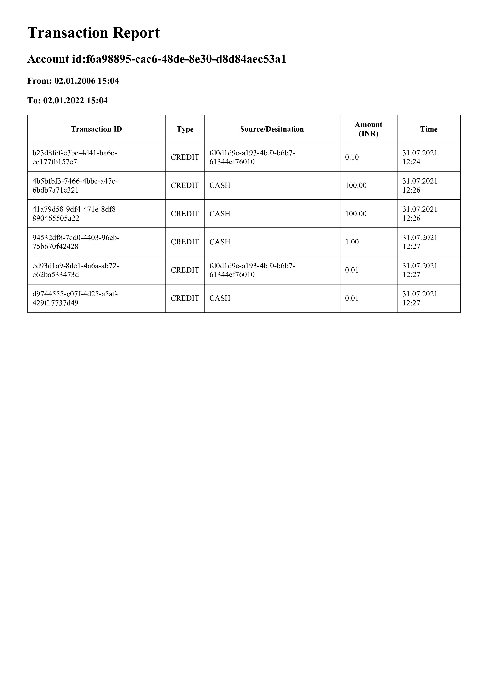

# Banking-System

 - Language: Golang
 - Framework: Echo

## Prerequisite
- Update config file ``(pkg/config/config.json)`` with required credentials, 
- Create new database ``banking-system`` in postgress
- Create new schema ``banking-system`` inside database
- Add Admin user 
    - sql

    ``INSERT INTO "banking-system".employee (id,"name",email,"password","type",created_by,updated_by)
        VALUES ('df7df0a1-0121-49d4-8ad8-9ede2d1fb12e'::uuid,'admin-user','admin@ska.com','dGVzdFBhc3N3b3Jk','ADMIN','system','system'``
    - Note: Password should be base64 encoded

- Install wkhtmltopdf using below command
  - ``sudo apt install wkhtmltopdf`` - for Ubuntu
  - ``brew install Caskroom/cask/wkhtmltopdf`` - For Mac

## To Run the project

- ``go run main.go``

## Features

- Admin role with features:
  - Sign in/out as admin.
  - Add bank employees.
  - Delete employees.
- Employee role with feature:
  - Sign in/out as an employee.
  - Create a customer.
  - Create accounts like savings, salary, loan, current account etc.
  - Link customers with accounts.
  - Update KYC for a customer.
  - Get details of a customer.
  - Delete customer.
  - Get account balance for an account.
  - Transfer money from one account to another.
  - Print Account statement of an account for a time range in pdf.
  - Calculate interest for the money annually (at 3.5% p.a.) and update the account balance.

## Project Structure

 - Business Logic sits inside ``internal``.
 - Independent module, which do not contain any business logic is in ``pkg`` folder
 - All the Database calls are made through repository
 - Service layer contains business logic
 - Handler process incoming data and send it to service layer
 - Router calls handler method
 - Factory create instances of handlers and pass it to router
 - Authentication is a middleware which enables authtication of API calls
 - Configuration package enables configuring of variable
 - JWT module is reponsible for creation and verification of jwt tokens

## API documents
 - [Postman collection] (source/Banking%20System.postman_collection.json)

### Sample PDF

